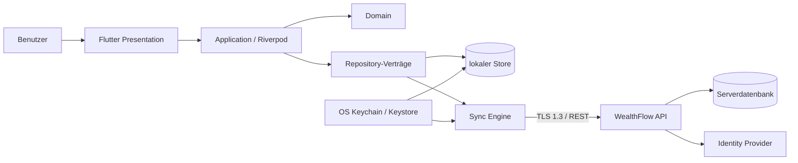
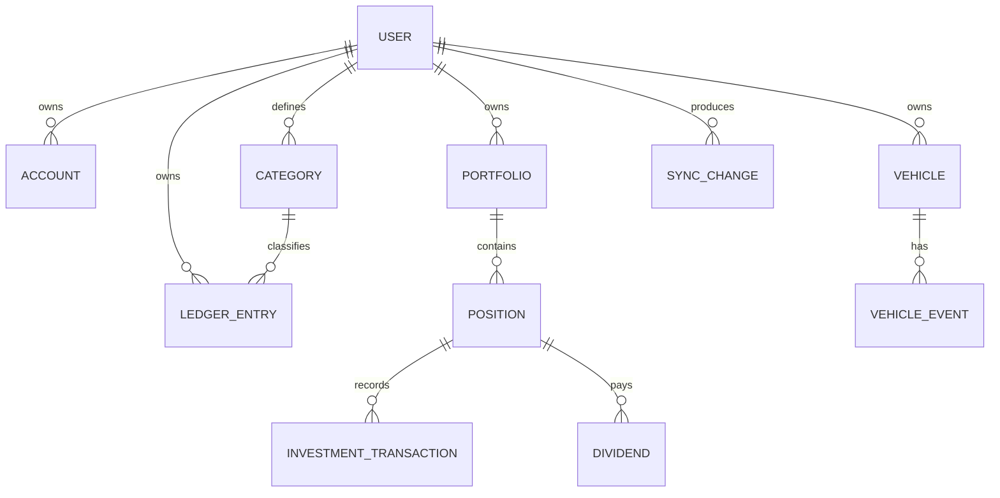
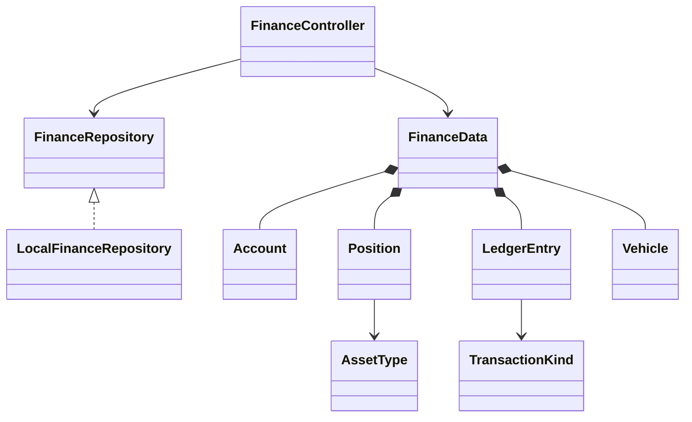
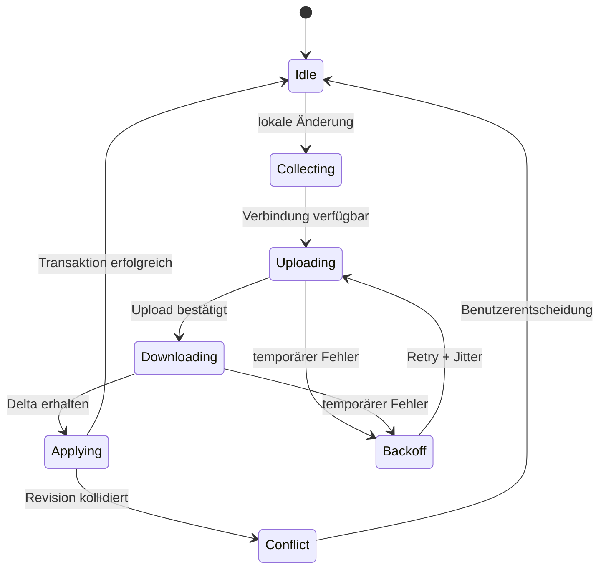

# WealthFlow – Systemdesign

Dieses Dokument konsolidiert die Entwurfsphasen 2 bis 12. Es ist der verbindliche technische Vertrag für die inkrementelle Implementierung.

## Architektur und Vertrauensgrenzen



Die Domain importiert weder Flutter noch Persistenzcode. Presentation kennt ausschließlich Application-Provider. Data implementiert Domain-Verträge. Plattformabhängigkeiten werden hinter Adaptern gekapselt.

## Datenmodell



Alle Entitäten besitzen UUID, `user_id`, Revision, Erstellungs-/Änderungszeitpunkt und optionalen Löschzeitpunkt. Geld wird als Minor Units plus ISO-Währung gespeichert. Für `user_id`, Änderungszeit, fachliche Zeit und häufige Filter werden zusammengesetzte Indizes geführt.

## Ordnerstruktur

```text
lib/
  l10n/                         Übersetzungsressourcen
  src/
    application/               Provider und Use-Case-Orchestrierung
    data/                       Repository-Implementierungen und Persistenz
    domain/                     Modelle, Regeln und Berechnungen
    presentation/               adaptive Shell, Theme, Seiten, Widgets
test/
  domain/                       deterministische Fachtests
docs/                           Produkt- und Systemverträge
```

Mit wachsendem Umfang wird jede Fachdomäne unter `features/<feature>/{presentation,application,domain,data}` verschoben. `core` darf keine Features importieren; Features kommunizieren über Domain-Verträge.

## Klassenmodell



`FinanceController` orchestriert atomare Mutationen und persistiert erst ein konsistentes Aggregat. Fachberechnungen sind reine Funktionen und damit unabhängig testbar.

## UI- und Navigation

- Kompakt (`<840 px`): Bottom Navigation; mittel/erweitert: NavigationRail; ab `1180 px` erweitert mit Labels.
- Hauptziele: Übersicht, Konten, Portfolio, Haushalt, Statistik und Mehr.
- Detailmodule: Dividenden, ETF-Rechner, Fahrzeuge, Fahrtkosten, Transfer und Einstellungen.
- Karten verwenden semantische Überschriften, 24-px-Radien, Material-3-Farbschema und sichtbare Fokuszustände.
- Loading, Empty und Error sind eigenständige Zustände; Animationen überschreiten 500 ms nicht und respektieren reduzierte Bewegung.

## API-Vertrag

Basis: `/api/v1`, JSON UTF-8, HTTPS. Listen verwenden `limit` und opaken `cursor`. Jede Mutation trägt `Idempotency-Key` und `If-Match` mit Revision.

| Methode | Route | Zweck |
|---|---|---|
| POST | `/auth/register` | Benutzer registrieren |
| POST | `/auth/login` | Access-/Refresh-Session starten |
| POST | `/auth/refresh` | Token rotieren |
| DELETE | `/auth/sessions/{id}` | Session widerrufen |
| GET/POST | `/accounts` | Konten lesen/anlegen |
| GET/POST | `/positions` | Positionen lesen/anlegen |
| GET/POST | `/ledger-entries` | Buchungen lesen/anlegen |
| GET/POST | `/vehicles` | Fahrzeuge lesen/anlegen |
| GET | `/sync/changes?cursor=` | Delta herunterladen |
| POST | `/sync/changes` | Delta idempotent hochladen |

Fehler folgen `application/problem+json` mit `type`, `title`, `status`, `code`, `traceId` und feldbezogenen Validierungsfehlern. Zugangsdaten dürfen nie Bestandteil von URL, Log oder Fehlerantwort sein.

## Lokale Persistenz

Die erste ausführbare Ausbaustufe persistiert das versionierte Aggregat über den plattformübergreifenden Flutter-Preferences-Adapter. Vor Speicherung hochsensibler Konto- oder Authentifizierungsdaten wird dieser Adapter durch das geplante verschlüsselte SQLite-Repository ersetzt. Repository-Verträge halten Presentation und Domain davon unabhängig. Migrationen sind vorwärtsgerichtet, transaktional und erstellen vor irreversiblen Änderungen ein geprüftes Backup.

## Synchronisation



Änderungen werden journalisiert und per Cursor übertragen. Tombstones verhindern Wiederauferstehung gelöschter Daten. Serverrevision gewinnt nicht automatisch: additive Ereignisse werden vereinigt, Stammdatenkonflikte erhalten eine explizite Auswahl. Moduswechsel benötigt Vorschau, Backup und bestätigte Zielrichtung.

## Sicherheit

- Serverpasswörter: Argon2id mit individuellem Salt und regelmäßig überprüften Parametern; niemals Clientpersistenz.
- Access Tokens kurzlebig, Refresh Tokens rotierend und widerrufbar; Web bevorzugt `HttpOnly`, `Secure`, `SameSite` Cookies mit CSRF-Token.
- Lokale Schlüssel in Keychain/Keystore; Datenbanken und Backups authentifiziert verschlüsselt. API-Keys werden nie im normalen Preferences-Store abgelegt.
- Serverseitige Mandantenprüfung für jede Abfrage und Mutation; parametrisierte SQL-Abfragen und Eingabeschemata.
- CSP, kontextbezogenes Encoding und keine Darstellung importierter Inhalte als ungeprüftes HTML.
- Protokolle redigieren Token, IBAN, API-Key, Notizen und Finanzwerte. Security-Ereignisse enthalten nur pseudonyme IDs.
- Export benötigt erneute Bestätigung, nennt sensible Felder und neutralisiert Tabellenformeln in CSV/XLSX.

## Produktions-Gates

Vor der Freigabe des Servermodus sind verschlüsselte SQLite-Persistenz, Secure Storage, Authentifizierung, Delta-Sync, Konflikttests und ein externes Security-Review zwingend. Flutter Analyze, Unit-, Widget-, Integrations-, Golden-, Contract- und Plattformbuildtests laufen in CI. Kritische Geld- und Synchronisationsregeln benötigen vollständige Branch-Abdeckung.
