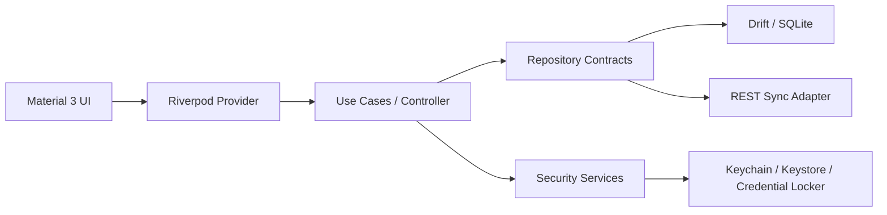
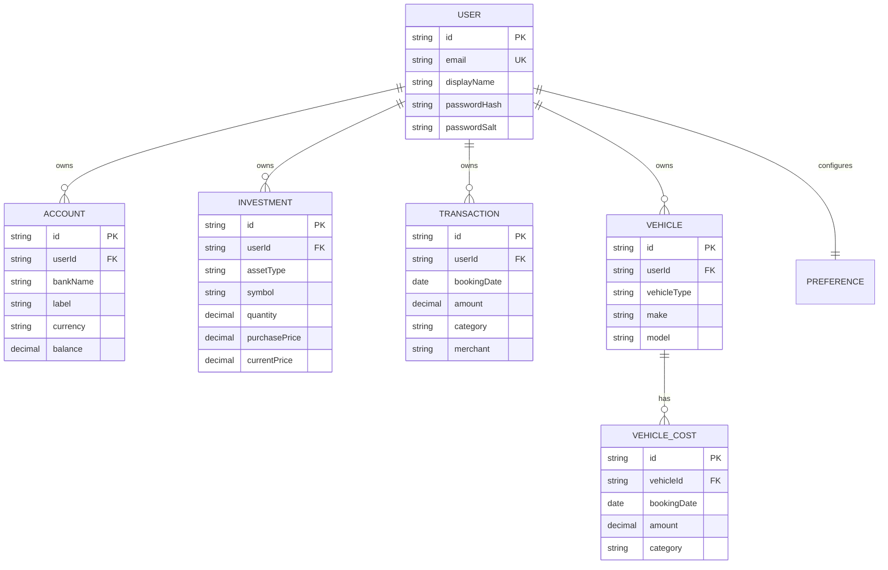
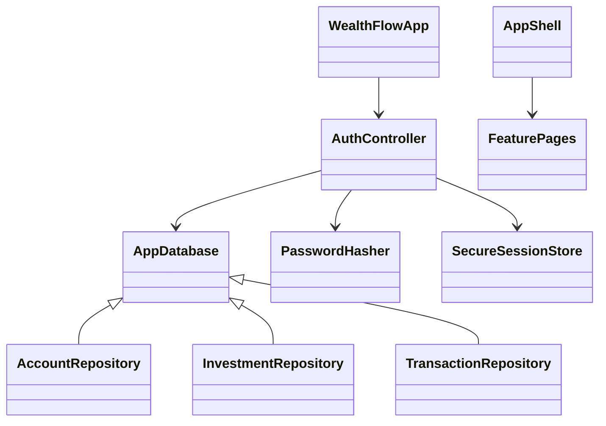

# WealthFlow – technisches Konzept

## 1. Projektplanung

Die Umsetzung folgt vertikalen, jeweils lauffähigen Ausbaustufen:

1. Plattformfundament, Theme, Navigation und Dependency Injection
2. lokale Identität, Sitzung und mandantensichere Persistenz
3. Konten, Investments, Haushaltsbuch und Dashboard
4. Fahrzeuge, Rechner, Statistiken und globale Suche
5. Import/Export, Backup und Delta-Synchronisation
6. produktives Server-Backend, Konfliktauflösung und rollenbasierte Freigaben

Jede Stufe wird durch statische Analyse, Unit-/Widgettests und mindestens einen Produktions-Build abgesichert.

## 2. Architekturdiagramm



Die Struktur ist feature-first. Präsentation hängt von Anwendungsdiensten und Domainmodellen ab; Persistenz- und Transportdetails bleiben austauschbar. Riverpod ist Composition Root und Dependency Injection.

## 3. ER-Diagramm



Geldbeträge werden in der ersten lokalen Version als SQLite `REAL` gespeichert. Vor einem Zahlungsverkehrsmodul wird auf Integer-Minor-Units migriert, damit Rundungsregeln pro Währung explizit sind.

## 4. Ordnerstruktur

```text
lib/
  app/                  App, Theme, responsive Shell
  core/database/        Drift-Schema und Abfragen
  core/security/        Hashing und sichere Sitzung
  core/widgets/         wiederverwendbare UI-Bausteine
  features/             vertikale Fachmodule
```

## 5. Klassenmodell



Repository-Funktionen erzwingen `userId` als Filter. Die UI erhält keine ungefilterten Tabellenzugriffe.

## 6. UI-Konzept

- Material 3 mit ruhiger Indigo-/Mint-Farbwelt und semantischen Gewinn- und Verlustfarben
- 12/16/24-Pixel-Abstandsraster, große Radien und zurückhaltende Schatten
- eine Dashboard-Spalte unter 700 px, zwei Spalten darüber
- NavigationRail ab 900 px, NavigationBar darunter
- Dialoge/Bottom-Sheets für kurze CRUD-Abläufe; Detailseiten für Analyse
- barrierearme Kontraste, Tooltips, echte Labels und skalierbarer Text

## 7. Navigationskonzept

Die fünf dauerhaften Hauptziele sind Dashboard, Finanzen, Haushaltsbuch, Statistik und Mehr. „Finanzen“ bündelt Konten, Portfolio und Dividenden; „Mehr“ führt zu Fahrzeuge, Rechner, Suche und Einstellungen. Das hält die mobile Navigation bedienbar und bildet dieselbe Informationsarchitektur im Rail ab.

## 8. Datenmodelle

Alle Datensätze haben UUID, Besitzer, Erstell-/Änderungszeitpunkt, Soft-Delete- und Synchronisationsstatus. Berechnete Werte wie Depotwert, Gewinn und Sparquote werden nicht redundant gespeichert, sondern aus Quelldaten ermittelt.

## 9. API-Konzept

Versionierte HTTPS-REST-Endpunkte:

```text
POST /v1/auth/login
POST /v1/auth/refresh
GET  /v1/sync/changes?cursor=...
POST /v1/sync/batch
```

Änderungen tragen `entityId`, `entityType`, `revision`, `changedAt`, `deletedAt` und eine idempotente `operationId`. Zugriffstoken sind kurzlebig; Refresh-Tokens rotieren und werden ausschließlich sicher gespeichert. Serveradresse und Port werden validiert, HTTP ist außerhalb lokaler Entwicklung unzulässig.

### Marktdaten

Aktien werden global in `StockMasters` gepflegt und von Benutzer-Portfolios nur
referenziert. Dadurch entstehen Kursabfragen nicht pro Benutzer. Der
providerneutrale `MarketDataCoordinator` plant höchstens eine Batch-Abfrage je
Zeitfenster (10:00, 15:00 und 19:00 Uhr), prüft vorher den lokalen Cache und
führt ein hartes Tagesbudget von 250 Requests. Kurse, Abrufzeitpunkte sowie
jahresweise Dividendenhistorien werden lokal gespeichert. Der API-Key liegt
ausschließlich im Plattform-Schlüsselspeicher. Ohne Key oder konkreten
HTTP-Adapter werden keine Requests ausgelöst.

## 10. Lokale Datenbank

Drift erzeugt parametrisierte SQL-Abfragen und verhindert Stringverkettung. Indizes liegen auf Besitzer, Datum, Typ und Änderungszeit. Listen werden reaktiv gestreamt; große Tabellen erhalten Cursor-Pagination. Schemaänderungen laufen ausschließlich über versionierte Migrationen.

## 11. Synchronisationskonzept

Ein Outbox-Verfahren überträgt nur geänderte Zeilen. Nach erfolgreichem Batch speichert die App einen Server-Cursor. Konflikte werden anhand Revision und Änderungszeit erkannt; Finanzbuchungen werden nie still überschrieben. Automatische Synchronisation nutzt Backoff, Jitter, idempotente Operationen und Netzwerkstatus. Moduswechsel exportiert vorab ein verschlüsseltes Backup.

## 12. Sicherheitskonzept

- Passwörter: PBKDF2-HMAC-SHA-256, zufälliges 128-Bit-Salt, konstante Zeitprüfung; serverseitig später Argon2id
- Sitzung/Secrets: Keychain, Android Keystore, Credential Locker bzw. libsecret; Web ausschließlich unter HTTPS
- Mandantentrennung: Besitzerfilter in jeder Repository-Abfrage und serverseitig nochmals autorisieren
- Transport: TLS, Zertifikatsprüfung, kurze JWT-Laufzeit, Tokenrotation
- Eingaben: Längen-, Typ- und Bereichsvalidierung; parametrisierte SQL-Abfragen
- Web: CSP, HSTS, SameSite/HttpOnly-Cookies falls Cookie-Auth, CSRF-Token; keine Tokens in Logs oder URLs
- Backups: authentifizierte Verschlüsselung, Integritätsprüfung und benutzerinitiierte Wiederherstellung
- Rollen: Mitglieder verwalten ihre eigenen Finanzdaten; nur Administratoren verwalten Benutzerrollen und den globalen Aktienkatalog. Das erste lokale Konto kann bei der Registrierung ausdrücklich als Admin angelegt werden.

Der lokale Modus schützt Anmeldedaten und Sitzungsschlüssel. Eine vollständige Datenbankverschlüsselung benötigt pro Plattform einen geprüften SQLCipher-Build und Schlüsselrotation; sie darf nicht durch einen fest einkompilierten Schlüssel vorgetäuscht werden.
